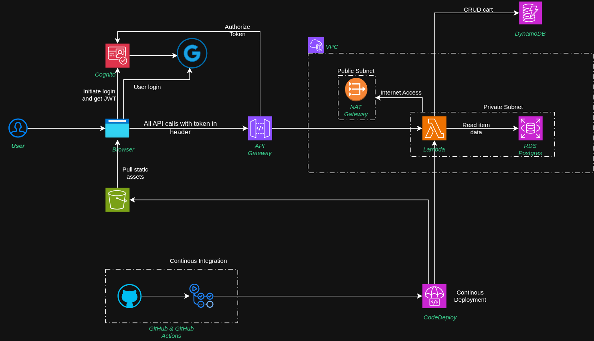
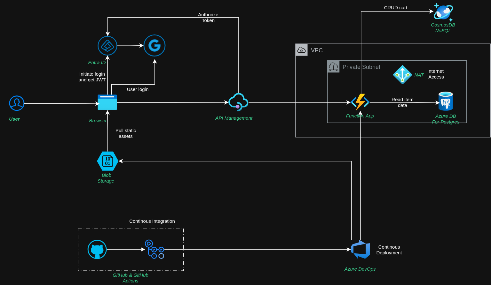
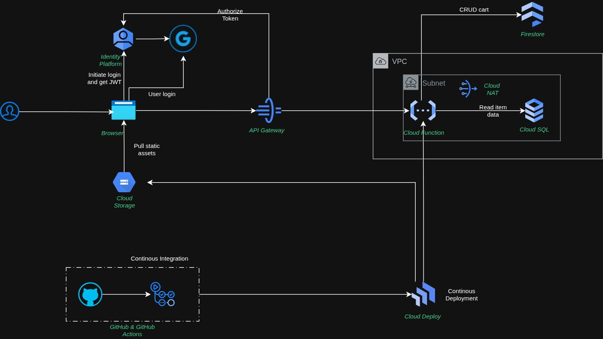

# Multi-Cloud Serverless Reference Architecture
## Cross-Provider Implementation: AWS, Azure, & GCP

This repository contains a reference implementation of a serverless commerce API deployed across the three major cloud providers. The project demonstrates a "write-once, run-anywhere" logic strategy, managed via infrastructure-as-code (OpenTofu) and automated CI/CD pipelines.

The core objective is to showcase identity federation (Google Social Login), private networking patterns, and polyglot persistence in a serverless context.

---

## Architectural Overview

The architecture follows a standardized pattern adapted to the specific networking and compute constructs of each provider, focusing on VPC isolation, private subnets, and managed service integration.

### Core Components
* **Identity:** OpenID Connect (OIDC) integration with Google.com via managed identity providers.
* **Compute:** Regional serverless execution environments VPC-integrated for secure backend access.
* **Storage (Relational):** Managed PostgreSQL instances for catalog data, isolated within private subnets.
* **Storage (NoSQL):** Global-scale document stores for session/cart management, accessed via NAT to demonstrate egress routing.
* **Edge:** API Gateway layers providing JWT validation and public REST interfaces.
* **Frontend:** Single Page Application (SPA) built with React, served via managed object storage.

### Provider-Specific Visuals

#### AWS Implementation

#### Azure Implementation

#### GCP Implementation

---

## Technical Stack Summary

| Component | AWS | Azure | GCP |
| :--- | :--- | :--- | :--- |
| **Compute** | AWS Lambda | Azure Function App | Cloud Run Functions |
| **Relational DB** | Amazon RDS (Postgres) | Azure DB for Postgres | Cloud SQL (Postgres) |
| **NoSQL DB** | DynamoDB | CosmosDB | Firestore |
| **Identity** | AWS Cognito | Microsoft Entra ID | Identity Platform |
| **Gateway** | Amazon API Gateway | Azure API Management | Cloud API Gateway |
| **IaC** | OpenTofu | OpenTofu | OpenTofu |

---

## CI/CD Pipeline Logic

The project utilizes a hybrid CI/CD strategy to bridge source control with provider-specific deployment engines.

* **Continuous Integration:** GitHub Actions handles the build phase, linting, and artifact creation.
* **Continuous Delivery:** * **AWS:** AWS CodeDeploy handles the transition of Lambda versions.
    * **Azure:** Azure DevOps pipelines manage the deployment to Function App slots.
    * **GCP:** Google Cloud Deploy orchestrates the release to Cloud Run.

---

## Architectural Decision Records (ADRs)

### Networking and Egress
To demonstrate the necessity of NAT Gateways and Egress Controllers in private serverless environments, NoSQL databases (DynamoDB, CosmosDB, and Firestore) were intentionally left outside the VPC. This forces the serverless compute to route through a NAT to reach the public endpoint, highlighting common pitfalls in serverless networking and egress cost management.

### Identity Federation
We utilize a "Double-Validation" pattern. The API Gateway/APIM layer authorizes the incoming JWT against the Google OIDC provider before the request ever reaches the compute layer, reducing unnecessary execution costs and improving the overall security posture.

### Infrastructure as Code
We use OpenTofu for provider-agnostic syntax. While the business logic is shared, separate state management and provider blocks are maintained to account for the fundamental differences in resource naming and hierarchy (e.g., GCP’s project-based approach vs. AWS’s account-based approach).

---

## Limitations and Non-Production Notice

This is a reference architecture intended for educational and demonstration purposes. Please note that the following list of omissions and technical debt is not exhaustive:

* **State Management:** OpenTofu state is managed locally. For production, a remote backend (S3/GCS/Blob) with state locking is required.
* **Deployment Strategies:** Deployment is "all-at-once." Canary or Blue/Green traffic shifting is not implemented.
* **Observability:** Metrics, Alarms, and structured logging (CloudWatch/Monitor/Operations Suite) are not configured.
* **Security:** Static website hosting is currently served over HTTP. Production environments must utilize CDNs with SSL certificates for HTTPS.
* **Code Refinement:** The application layer contains provider-specific conditional logic that should be refactored into a clean Repository Pattern for production use.
* **Private Endpoints:** For production, communication between compute and NoSQL stores should be handled via Private Links/Endpoints rather than NAT gateways.